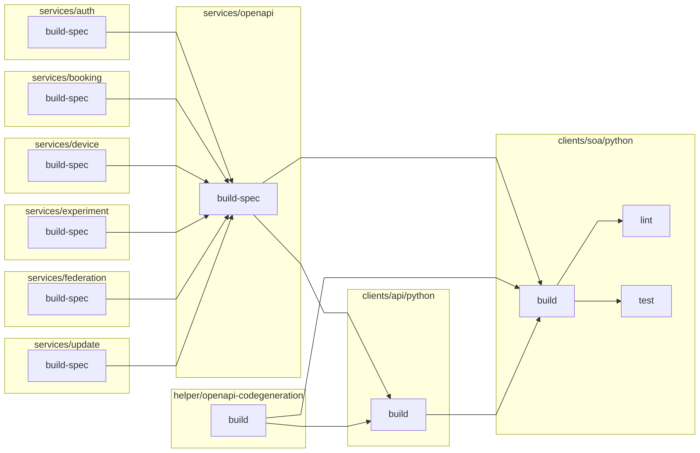

# GOLDi2 Monorepo

## Subprojects

### Dependencies

[//]: # (Dependencies)

### Backend Services

| Name       | build-spec                                                                                               | linting                                                                                            |
| ---------- | -------------------------------------------------------------------------------------------------------- | -------------------------------------------------------------------------------------------------- |
| auth       |        |        |
| booking    |     |     |
| device     |      |      |
| experiment |  |  |
| federation |  |  |
| update     |      |      |
| openapi    |     |     |

### Clients

| Name             | build                                                                                 | lint                                                                                | test                                                                                |
| ---------------- | ------------------------------------------------------------------------------------- | ----------------------------------------------------------------------------------- | ----------------------------------------------------------------------------------- |
| api (javascript) |      |    |    |
| api (python)     |  |  |  |
| soa (javascript) |    |    |    |
| soa (python)     |  |  |  |

#### SOA Services

| Name                           | build                                                                                                              | lint                                                                                                             | test                                                                                                             |
| ------------------------------ | ------------------------------------------------------------------------------------------------------------------ | ---------------------------------------------------------------------------------------------------------------- | ---------------------------------------------------------------------------------------------------------------- |
| Electrical Connection (python) |  |  |  |

### Helper

| Name                      | build                                                                                               |
| ------------------------- | --------------------------------------------------------------------------------------------------- |
| crosslab-typescript-addon |  |
| openapi-codegeneration    |     |
| tsdoc-theme               |                |
